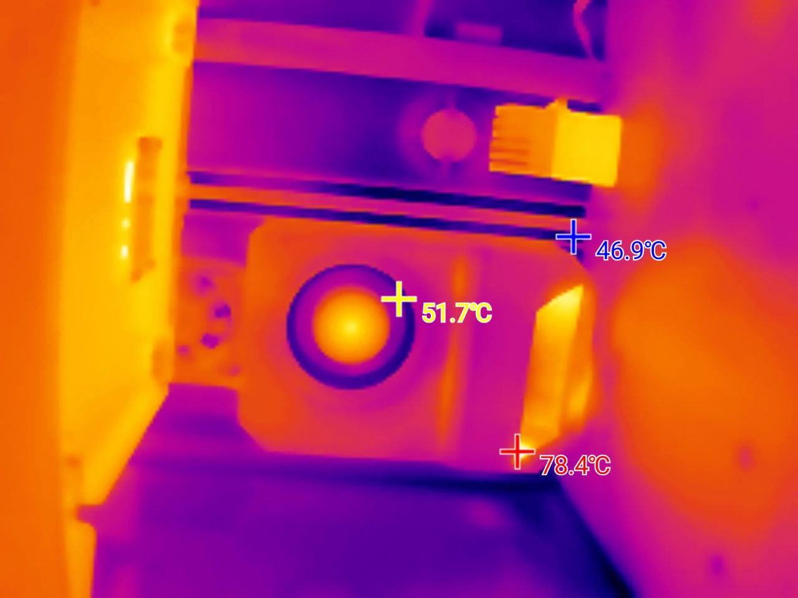

_# K1C-chamber-heater

Постоянно печатаю ABS, так что давно хотел сделать нагреватель камеры, пробовал разные варианты, например [такой](https://www.printables.com/make/2215362) на 24 вольта, выявил несколько проблем  
1. Обдув должен быть от улитки 12030
2. Знать температура нагревателя
3. Горячий воздух должен быть направлен на стекло(стенки плавятся)

Появилось время, наткнулся на видео [NoizieWorks](https://www.youtube.com/watch?v=dcIuKb0kHWA) нагреватель Qidi Plus 4, было принято решение попробовать собрать из него нагреватель для своего K1C  

И так, нам понадобится:

1. [QIDI Plus4 chamber heater](https://aliexpress.ru/item/1005007804483549.html?sku_id=12000042258968076) 4328 ₽.
2. [STM32-Klipper-Expander](https://aliexpress.ru/item/1005002384419036.html?sku_id=12000020472565357) 1359 ₽ плата расширения, доп. выходы, нужна для подключения нагревателя, термистора нагревателя и вентилятора
3. Винты 15x[M3x6 FHCS](https://aliexpress.ru/item/4001072025844.html)
4. Винты 3x[M3x40 FHCS](https://aliexpress.ru/item/4001072025844.html?sku_id=10000014059762471) для крепления вентилятора к корпусу нагревателя
5. Любая термопаста
6. Вплявляемые гайки 18xM3*3*4.5
7. Реле [SSR-40DA](https://aliexpress.ru/item/1005004040211802.html?sku_id=12000031095481981) 349 ₽
8. Провода 14awg протянуть до платы 220в(родных не хватит)
9. Провода для удлинения вентилятора
10. Провода для удлинения термистора
11. Коннектор [jst ph2.0 4pin](https://aliexpress.ru/item/1005008769943807.html) 
12. Обжимка для коннектора jst ph2.0 4pin
13. Кабель micro usb
14. [Набор инструментов для обжима и зачистки наконечников](https://www.ozon.ru/product/nabor-instrumentov-dlya-obzhima-i-zachistki-nakonechnikov-soderzhashchiy-odin-1813569243/?at=RltyDVDm9sQ81xRGi9jOv02fPjrkG0H2xQZKVcLPBz8D), если хотите обжать провода
15. [Кабельный наконечник НВИ](https://www.ozon.ru/product/kabelnyy-nakonechnik-nvi-dori-nabor-8-160sht-1416852199/?at=QktJ1x1AGc22vAApfvq23EZsqvzyKqIYv2VQKfP4B6jZ) ну и [пресс клещи ПК-16](https://www.ozon.ru/product/press-kleshchi-pk-16-dlya-mednyh-nakonechnikov-i-gilz-do-16kv-1566599786/?at=A6tGKYK6ycRxrKwZUJRzZG3cmqo58jCgmKVnMsM4Mk0D&from_sku=1566599786&oos_search=false)
16. Катушка [Polymaker Fiberon PA6-GF25](https://fiberon.polymaker.com/product/pa6-gf25/) купить можно на [ozon](https://www.ozon.ru/product/pa6-gf25-fiberon-plastik-polymaker-dlya-3d-printera-1-75-mm-seryy-0-5-kg-1785755210/), у пластика тмпература деформации 190 градусов, кароч крутой материал  ~ 2300₽ за 0.5кг
17. Обычный abs для холодной части я использовал ERYONE ABS Carbon, брал [тут](https://www.ozon.ru/product/plastik-abs-carbon-cf-chernyy-black-dlya-3d-printera-eryone-1kg-1704937868/) ~ 2300₽ за 1кг
18. [Оплетка для проводов](https://www.ozon.ru/product/opletka-kabelnaya-iz-poliestera-zmeinaya-kozha-10-8-20mm-cherno-krasnaya-10m-1710567427/?at=gpt41kO8yhBN0qPZtAlk3VCYV64zBH6K9DQ7s6YQp2A)
19. TPU для печати заглушки для проводов

**Итого**: 4328+1359+2300+2300=10287₽ и это без учета обжимок и всякой мелочи, 10 раз думаем надо ли оно вам, если надо идем дальше.

### Прошивка Klipper-Expander
Подключаем Klipper-Expander к тачке на которой у нас есть linux  
клонируем репу клипера `git cone https://github.com/Klipper3d/klipper.git` и дальще по [инструкции](https://github.com/VoronDesign/Voron-Hardware/blob/master/Klipper_Expander/Documentation/Setup_and_Flashing_Guide.md) к Klipper-Expander

После прошивки можно подключить плату в usb принтера и проверить что все работает
Находим наш stm32 `ls /dev/serial/by-id/*` Добавляем секцию с нашим mcu
```yaml
[mcu expander]
serial: /dev/serial/by-id/usb-Klipper_stm32f042x6_1B0027001453303755373220-if00
restart_method: command
```
В информации о системе в fluidd мы его увидим

### Крепление Klipper-Expander
Для крепления я напечатал 2 стойки впаял в них гайки с одной и другой стороны, сделал в принтере 2 дырки и прикрутил, модельки не осталось, но думаю не проблема начертить цилиндр диарметром 6мм с дыркой 4мм  

Компановка корпуска выглядит так, у меня стол на 220, так что пришлось впихнуть 2 SSR

Я подключал Klipper-Expander к порту лидара, но если он используется, то можно подключить к порту usb, скорее всего флешками с g-кодом уже не польуются  
Отрезаем по размеру кабель, обжимаем его коннектором ph2.0, провода в кабеле по цветам такие же как на соседних портах, например от порта usb  

Так же надо подключить питание 24в которое будет подаваться на наши мосфеты на плате Klipper-Expander

### Подключение SSR
Подкючаем управляющие контакты к Klipper-Expander порты можно посмотреть в [документации](https://github.com/VoronDesign/Voron-Hardware/blob/master/Klipper_Expander/Documentation/README.md#mosfets-pa0-pa1-pa2-pa3)
Схема подключения SSR


### Сборка корпуса
1. Вплавляем все гайки
2. Скручиваем горячую и холодную часть
3. Разбираем нареватель от QIDI Plus4
4. Вплавляем гайти в вентилятор 12030

5. Стираем термопасту, вытаскиваем термистр
6. Переклеиваем каптоновый скотч в новый корпус засовываем термистр, наносим термопасту, ставим нагреватель
7. Вставляем вентилятор 
8. Утсанавливаем заглушку

### Установка в корпус
Снимаем боковые стенки, примеряем место для утстановки, корпус крепится на 3 винта, так что надо сделать еще 3 дырки в задней крышке принтера, задняя часть холодной части корпуса можно использовать как шаблон  
Протягиваем провода черех кбель каналы в подвал принтера, подключаем термистр, нагреватель на 220 и вентилятор, обрезаем провода по размеру, опресовываем.

*Вообще перед установкой просто подключите все без проводки в корпусе, проверьте что все работает*

### Конфиг
```yaml
---
[mcu expander]
serial: /dev/serial/by-id/usb-Klipper_stm32f042x6_1B0027001453303755373220-if00
restart_method: command
[temperature_sensor chamber_probe]
sensor_type: NTC 100K MGB18-104F39050L32
sensor_pin: expander:PA6
min_temp: -100
max_temp: 140

[heater_generic chamber]
heater_pin: expander:PA3
max_power: 0.6
# https://github.com/qidi-community/Plus4-Wiki/blob/main/content/chamber-heater-investigation/README.md
sensor_type: temperature_combined
sensor_list: temperature_sensor nozzle_mcu_temp, temperature_sensor chamber_temp, temperature_sensor chamber_probe, temperature_sensor chamber_temp
combination_method: mean
maximum_deviation: 90
control = pid
pid_Kp=63.418 
pid_Ki=1.342 
pid_Kd=749.125
min_temp: -100
max_temp: 80

[verify_heater chamber]
max_error: 400
check_gain_time: 600
hysteresis: 5
heating_gain: 2

[heater_fan chamber]
pin: expander:PA0
heater: chamber
heater_temp: 45
```

Из настройки видно что использвется комбинированный датчки температуры, почему так написано [тут](https://github.com/qidi-community/Plus4-Wiki/blob/main/content/chamber-heater-investigation/README.md)  
У меня родной термистор камеры закрыт [крышкой](https://www.printables.com/model/1167584-creality-k1k1ck1-max-chamber-thermistor-cover) и я получал с него температуру пластика, а не воздуха
А поднимать температуру воздуха который идет с нагревателя нельзя поднимать выше 85 градусов, иначе у нас перегреется mcu головы, так что нам надо получить заданную тмпературу именно воздуха 
Калибровать значение можно температурой сопла когда оно холодное, включаем вентилятор обдува модели и смотрим показание с нагревателя котороый берет медианное значение со списка сенсоров.

### Результаты
12-15 минут прогрев воздуха в принтере до 65 градусов при столе в 90
Когда была не правильно настроена температура грел принтер до 90, торубалась mcu головы.
Тесты на прочность не проводил, по факту уменьшил температуру стора для abs с 105 до 90

Фотки нагретого принтера термокамерой



